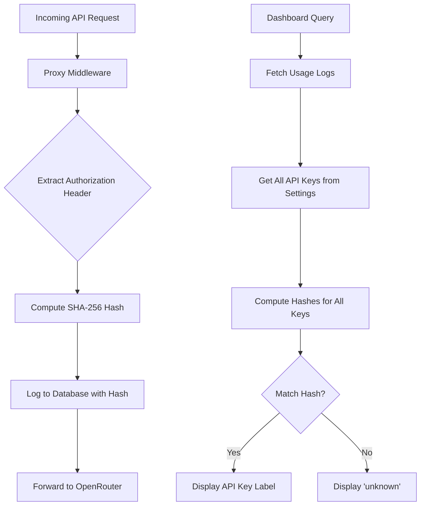
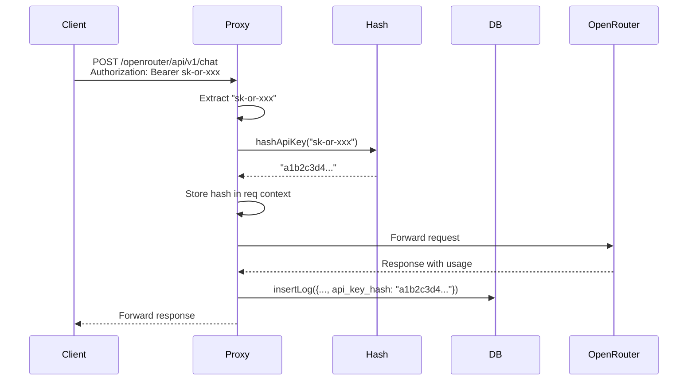

# Solution Design Report: API Key Association for Usage Logs

## 1. Problem Statement

### Business Need
The OpenRouter Usage Proxy currently logs API usage data but has no way to track which API key was used for each request. Users who manage multiple OpenRouter API keys need to:
- Track usage per API key for cost allocation
- Identify which key was used for each logged request
- View key-specific usage statistics in the dashboard

### Current State
- The proxy middleware (`/server/src/middleware/proxy.ts`) intercepts requests and logs usage data
- API keys are already managed via the settings system (`/server/src/db/settings.ts`)
- Usage logs are stored in SQLite (`usage_logs` table) with model, tokens, cost, etc.
- The proxy passes through the client's `Authorization` header unchanged (transparent proxy)
- **No link exists between logged requests and the API keys used**

### Desired Outcome
After implementation:
1. Each usage log record will have a hash identifying which API key was used
2. The hash must be deterministic (same key = same hash) for lookup
3. The dashboard will display the API key name (label) if the hash matches a known key
4. For unknown/deleted keys, display "unknown"
5. **Critical security requirement**: Never store the actual API key in usage logs

---

## 2. Proposed Solution

### Overview
Implement a **SHA-256 hash-based API key identification system** that:
1. Extracts the API key from the `Authorization` header in the proxy middleware
2. Computes a SHA-256 hash of the key (deterministic and secure)
3. Stores the hash in a new `api_key_hash` column in the `usage_logs` table
4. On display, looks up the hash against stored API keys to resolve the label
5. Shows "unknown" for hashes that don't match any current keys

### Architecture



### Key Design Decisions

| Decision | Rationale |
|----------|-----------|
| **Use SHA-256 for hashing** | Industry-standard, deterministic, collision-resistant, fast to compute |
| **Store hash in usage_logs table** | Direct association, efficient queries, no joins needed |
| **Compute hash on every request** | Stateless design, no caching complexity, minimal performance impact |
| **Resolve label at display time** | Allows key renaming/deletion without orphaning logs |
| **Handle missing Authorization gracefully** | Not all requests may have keys (errors, health checks) |
| **Use Node.js crypto module** | Built-in, no external dependencies, consistent behavior |

### Alternatives Considered

| Alternative | Pros | Cons | Why Not Chosen |
|-------------|------|------|----------------|
| **Store API key ID instead of hash** | Direct lookup, no computation | Exposes internal IDs, breaks if key deleted | Doesn't handle keys added after requests were made |
| **Use MD5 hash** | Faster computation | Weaker security, deprecated | SHA-256 is fast enough and more secure |
| **Use HMAC with secret** | Additional security layer | Requires secret management, complicates deployment | Overkill for this use case; SHA-256 sufficient |
| **Compute hash only once and cache** | Slightly faster | Adds state management, memory overhead | Premature optimization; hashing is already fast |
| **Store full API key encrypted** | Complete key recovery possible | Security risk if encryption key compromised | Violates requirement to not store actual key |

---

## 3. Implementation Details

### Files to Create/Modify

| File | Action | Purpose |
|------|--------|---------|
| `/server/src/db/schema.ts` | Modify | Add `api_key_hash` column to schema, create migration |
| `/server/src/types/index.ts` | Modify | Add `api_key_hash` to `UsageLog` and `UsageLogInput` types |
| `/server/src/middleware/proxy.ts` | Modify | Extract API key from header and compute hash |
| `/server/src/db/index.ts` | Modify | Update `insertLog` to include hash |
| `/server/src/routes/logs.ts` | Modify | Add endpoint to resolve hashes to labels |
| `/client/src/types/index.ts` | Modify | Add `api_key_label` to `UsageLog` type |
| `/client/src/components/LogsTable.tsx` | Modify | Display API key label column |
| `/client/src/hooks/useLogs.ts` | Modify | Fetch and merge API key labels |

### Step-by-Step Implementation Plan

#### 1. Database Schema Migration
**What**: Add `api_key_hash` column to `usage_logs` table  
**Why**: Store the hash for each logged request  
**Files**: `/server/src/db/schema.ts`

- Add column definition: `api_key_hash TEXT` (nullable for backward compatibility)
- Create index on `api_key_hash` for efficient filtering by key
- Add migration SQL to alter existing table
- Update `INSERT_USAGE_LOG` statement to include new column

#### 2. Type Definitions Update
**What**: Add `api_key_hash` to TypeScript interfaces  
**Why**: Type safety for new field  
**Files**: `/server/src/types/index.ts`

- Add `api_key_hash: string | null` to `UsageLog` interface
- Add `api_key_hash?: string | null` to `UsageLogInput` interface

#### 3. Hash Computation Utility
**What**: Create utility function to compute SHA-256 hash of API key  
**Why**: Reusable, testable hash computation logic  
**Files**: `/server/src/middleware/proxy.ts` (or new `/server/src/utils/hash.ts`)

```typescript
import { createHash } from 'crypto';

/**
 * Compute SHA-256 hash of an API key
 * @param apiKey - The API key to hash (e.g., "sk-or-...")
 * @returns Hex-encoded SHA-256 hash
 */
function hashApiKey(apiKey: string): string {
  return createHash('sha256').update(apiKey).digest('hex');
}
```

#### 4. Proxy Middleware Update
**What**: Extract API key from Authorization header and compute hash  
**Why**: Capture which key was used for each request  
**Files**: `/server/src/middleware/proxy.ts`

- In `proxyReq` handler, extract `Authorization` header
- Parse bearer token format: `Bearer sk-or-...`
- Compute hash using utility function
- Store hash in request context for use in `proxyRes` handler
- Pass hash to `insertLog` call in `proxyRes` handler

**Data Flow**:


#### 5. Database Insert Update
**What**: Update `insertLog` to accept and store hash  
**Why**: Persist hash with each log entry  
**Files**: `/server/src/db/index.ts`

- Update `insertStatement.run()` to include `api_key_hash` parameter
- No changes needed to other functions (SELECT statements will return new column)

#### 6. Hash-to-Label Resolution API
**What**: Add utility to resolve hashes to API key labels  
**Why**: Dashboard needs to look up labels from hashes  
**Files**: `/server/src/routes/logs.ts` or `/server/src/db/index.ts`

Create a resolver function:
```typescript
/**
 * Build a map of API key hashes to labels
 * Used for resolving hashes in usage logs to friendly names
 * @returns Map of hash -> label
 */
function buildApiKeyHashMap(): Map<string, string> {
  const apiKeys = getAllApiKeys();
  const hashMap = new Map<string, string>();
  
  for (const key of apiKeys) {
    const hash = hashApiKey(key.key);
    hashMap.set(hash, key.label);
  }
  
  return hashMap;
}

/**
 * Resolve API key hash to label
 * @param hash - SHA-256 hash of the API key
 * @returns API key label or "unknown" if not found
 */
function resolveApiKeyLabel(hash: string | null): string {
  if (!hash) return 'unknown';
  
  const hashMap = buildApiKeyHashMap();
  return hashMap.get(hash) || 'unknown';
}
```

Option: Add endpoint `/api/logs/api-key-map` that returns hash-to-label mapping
- This allows client to resolve labels without sending full key list

#### 7. Backend Types for Resolution
**What**: Add response type for logs with resolved labels  
**Why**: Type safety for enriched log data  
**Files**: `/server/src/types/index.ts`

```typescript
export interface UsageLogWithLabel extends UsageLog {
  api_key_label: string;
}
```

#### 8. Logs Endpoint Enhancement
**What**: Option to return logs with resolved API key labels  
**Why**: Client can receive enriched data directly  
**Files**: `/server/src/routes/logs.ts`

Two options:
- **Option A**: Always resolve labels in backend (simpler for client)
- **Option B**: Add query param `?resolveLabels=true` (more flexible)

Recommended: **Option A** - always resolve, minimal overhead

#### 9. Client Type Update
**What**: Add `api_key_label` to client-side `UsageLog` type  
**Why**: Display label in table  
**Files**: `/client/src/types/index.ts`

```typescript
export interface UsageLog {
  // ... existing fields
  api_key_hash: string | null;
  api_key_label?: string; // Optional, resolved on client
}
```

#### 10. Client Data Fetching Update
**What**: Fetch API key hash map and resolve labels  
**Why**: Display friendly names in dashboard  
**Files**: `/client/src/hooks/useLogs.ts`

- Fetch logs (includes `api_key_hash`)
- Fetch API keys list
- Compute hash for each key locally (or fetch hash map from backend)
- Merge labels into log objects
- Return enriched logs

**Alternative**: If backend resolves labels (step 8 Option A), no client changes needed here

#### 11. Dashboard Table Display
**What**: Add "API Key" column to logs table  
**Why**: Show which key was used  
**Files**: `/client/src/components/LogsTable.tsx`

- Add `<th>API Key</th>` to table header
- Add `<td>{log.api_key_label || 'unknown'}</td>` to table row
- Position between "Timestamp" and "Model" columns for visibility

#### 12. Migration Execution
**What**: Apply schema migration to existing database  
**Why**: Add new column without losing data  
**Files**: `/server/src/db/schema.ts`

Add migration function:
```typescript
export function migrateToApiKeyHash(db: Database): void {
  // Check if column exists
  const hasColumn = db.prepare(`
    SELECT COUNT(*) as count 
    FROM pragma_table_info('usage_logs') 
    WHERE name = 'api_key_hash'
  `).get() as { count: number };
  
  if (hasColumn.count === 0) {
    db.exec(`
      ALTER TABLE usage_logs ADD COLUMN api_key_hash TEXT;
      CREATE INDEX IF NOT EXISTS idx_usage_logs_api_key_hash 
      ON usage_logs (api_key_hash);
    `);
  }
}
```

Call migration in `/server/src/db/index.ts` after `initializeSchema()`.

---

### Dependencies
- **Internal**: 
  - `crypto` module (Node.js built-in) - for SHA-256 hashing
  - Existing API keys management system (`/server/src/db/settings.ts`)
  
- **External**: None - uses only built-in Node.js modules

---

## 4. Complexity & Risk Assessment

### Complexity Rating: **Medium**

**Reasoning**:
- Database schema change (migration required)
- Multiple file modifications across backend and frontend
- Data flow spans from middleware → database → API → client
- But: Well-defined interfaces, no complex algorithms, incremental changes

### Risk Areas

| Risk | Impact | Likelihood | Mitigation |
|------|--------|------------|------------|
| **Migration breaks existing DB** | High | Low | Test migration on copy of production DB; check column existence before adding |
| **Hash collisions** | Medium | Very Low | SHA-256 has negligible collision probability; no mitigation needed |
| **Performance impact on request logging** | Low | Low | SHA-256 is fast (~1-2ms); test with load if concerned |
| **API key deletion orphans logs** | Low | Medium | By design - show "unknown"; acceptable per requirements |
| **Missing Authorization header** | Low | Medium | Handle gracefully - store NULL hash, display "unknown" |
| **Key renamed but hash unchanged** | N/A | N/A | Expected behavior - historical logs keep old label association |

### Testing Strategy

1. **Unit Tests** (if test infrastructure exists):
   - Test `hashApiKey()` function with known inputs/outputs
   - Test hash map building with sample keys
   - Test label resolution with known/unknown hashes

2. **Integration Tests**:
   - Make API request with known key, verify hash stored correctly
   - Query logs endpoint, verify label resolved correctly
   - Delete API key, verify logs show "unknown"

3. **Manual Testing**:
   ```bash
   # 1. Add API key via settings
   curl -X POST http://localhost:3000/api/api-keys \
     -H "Content-Type: application/json" \
     -d '{"label": "Test Key", "key": "sk-or-test-key-123"}'
   
   # 2. Make proxied request with that key
   curl -X POST http://localhost:3000/openrouter/api/v1/chat/completions \
     -H "Authorization: Bearer sk-or-test-key-123" \
     -H "Content-Type: application/json" \
     -d '{"model": "openai/gpt-3.5-turbo", "messages": [{"role": "user", "content": "Hello"}]}'
   
   # 3. Check logs contain hash
   sqlite3 ~/.openrouter-proxy/usage.db "SELECT api_key_hash FROM usage_logs ORDER BY id DESC LIMIT 1;"
   
   # 4. Verify dashboard shows "Test Key" in logs table
   # 5. Delete API key via settings
   # 6. Verify dashboard now shows "unknown" for those logs
   ```

4. **Edge Cases to Test**:
   - Request without Authorization header → NULL hash, "unknown" label
   - Request with malformed Authorization header → NULL hash
   - Multiple keys with same label (different hashes) → works correctly
   - Key updated (label changed) → new requests get same hash, old logs unaffected
   - Key deleted → logs show "unknown"

### Rollback Plan

If issues occur:

1. **Immediate**: The new column is nullable, so existing code continues to work
2. **Backend rollback**:
   - Revert proxy middleware changes
   - Database column remains but unused (no data corruption)
3. **Frontend rollback**:
   - Remove API Key column from table
   - Revert type changes
4. **Full rollback** (if needed):
   ```sql
   -- Remove column (requires table rebuild in SQLite)
   ALTER TABLE usage_logs DROP COLUMN api_key_hash;
   DROP INDEX IF EXISTS idx_usage_logs_api_key_hash;
   ```
   Note: SQLite doesn't support DROP COLUMN directly in older versions; may need table recreation.

---

## 5. Open Questions

### For User Approval:

1. **Label Resolution Location**: Should we resolve API key labels on the backend (simpler for client) or client-side (more flexible)? 
   - **Recommendation**: Backend resolution for simplicity

2. **API Key Column Position**: Where in the logs table should "API Key" appear? 
   - **Recommendation**: Between "Timestamp" and "Model" for visibility

3. **Filter by API Key**: Should we add the ability to filter logs by API key in the dashboard (like we filter by model)?
   - **Recommendation**: Yes, but as a future enhancement (not in this design)

4. **Historical Data**: Existing logs will have NULL for `api_key_hash`. Is displaying "unknown" acceptable?
   - **Recommendation**: Yes, no way to retroactively determine which key was used

5. **Hash Algorithm Future-Proofing**: Should we store the hash algorithm used (e.g., "sha256:abc123...") to allow algorithm changes later?
   - **Recommendation**: No, YAGNI - can migrate later if needed

6. **Performance Concerns**: Should we implement caching of API key hash map?
   - **Recommendation**: No, premature optimization - measure first if concerned

---

## 6. Summary

This design provides a **secure, efficient, and maintainable** solution for associating API calls with API keys without storing sensitive data. The hash-based approach:

- ✅ Meets all requirements (no key storage, deterministic hash, name display)
- ✅ Uses standard cryptographic functions (SHA-256)
- ✅ Handles edge cases (missing keys, deleted keys)
- ✅ Minimal performance impact
- ✅ Backward compatible (nullable column)
- ✅ No external dependencies

**Estimated Implementation Time**: 4-6 hours for a single developer

**User Approval Needed**: Please review and approve this design before proceeding to implementation.
